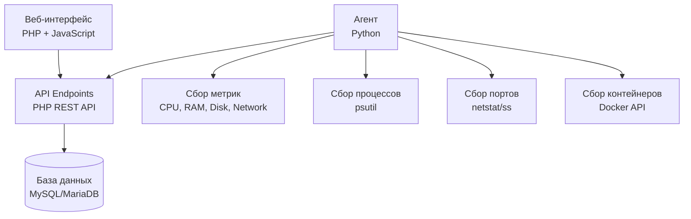

<div align="center">

#  HostMonitor

### Современная система мониторинга серверов с веб-интерфейсом

[](LICENSE)
[](https://www.python.org/)
[](https://www.php.net/)
[](https://www.mysql.com/)

**Мониторинг серверов в реальном времени | Метрики | Процессы | Порты | Контейнеры**

[🚀 Быстрая установка](#-быстрая-установка) • [📖 Документация](#-документация) • [ Конфигурация](#️-конфигурация) • [🛡️ Безопасность](#️-безопасность)

</div>

---

##  Содержание

- [Возможности](#-возможности)
- [Архитектура](#-архитектура)
- [Требования](#-требования)
- [Быстрая установка](#-быстрая-установка)
- [Конфигурация](#️-конфигурация)
- [Использование](#-использование)
- [Безопасность](#️-безопасность)
- [Поддержка](#-поддержка)

---

## ✨ Возможности

<table>
<tr>
<td width="50%">

###  Мониторинг
-  **Метрики в реальном времени**: CPU, RAM, Disk, Network
-  **GPU мониторинг**: Загрузка, память, температура
-  **Процессы**: Список запущенных процессов с деталями
-  **Порты**: Мониторинг открытых портов и соединений
-  **Контейнеры**: Docker контейнеры и их статусы

</td>
<td width="50%">

###  Интерфейс
-  **Современный веб-интерфейс**: Адаптивный дизайн
-  **Дашборд**: Обзор всех нод на одной странице
-  **Графики**: Визуализация метрик и трендов
-  **Уведомления**: Система алертов и уведомлений
-  **Биллинг**: Учет расходов на провайдеров

</td>
</tr>
</table>

###  Безопасность
-  Аутентификация пользователей (сессии + Bearer token)
-  Токены для агентов (NODE_TOKEN + Bearer)
-  CSRF-защита всех POST-запросов (X-CSRF-Token header)
-  Security-заголовки (X-Content-Type-Options, X-Frame-Options, X-XSS-Protection, Referrer-Policy)
-  Brute-force защита (5 попыток / 15 мин lockout)
-  Защита от SQL-инъекций (PDO prepared statements)
-  Защита от XSS (esc/escapeHtml для всех пользовательских данных)
-  Защита от XXE (LIBXML_NONET для XML-парсинга)
-  Защита от SSRF (allowlist URL, запрет FOLLOWLOCATION)
-  Защита от command injection (escapeshellarg, валидация параметров)
-  TLS/SSL поддержка с валидацией сертификатов
-  Безопасность сессий (HttpOnly, SameSite=Lax, Secure при HTTPS)
-  Регенерация session ID после логина
-  Generic ошибки (утечка $e->getMessage() устранена)
-  Агент: allowlist node.conf, запрет опасных команд без флага
-  Агент: health server только на 127.0.0.1
-  Агент: отказ от запуска без HTTPS (MASTER_URL_INSECURE для override)

### ⚡ Производительность
- ⚡ Легковесный агент (Python)
- ⚡ Быстрый веб-интерфейс (PHP + JS)
- ⚡ Оптимизированные SQL запросы (batch INSERT, 8 индексов для retention)
- ⚡ Кэширование метрик
- ⚡ Свертывание дублей логов на стороне агента
- ⚡ Тримминг raw_message перед отправкой (≤500 символов)
- ⚡ Тонкая настройка retention (500K / 50K строк на ноду)

###  Расширенные возможности
-  **SMART мониторинг**: Состояние дисков, температура, наработка,bad sectors
-  **DB HA**: Синхронизация базы данных между primary/replica
-  **LLDP/SNMP**: Автообнаружение сетевого оборудования
-  **Экспорт нод**: JSON-экспорт/импорт конфигураций (токены автоматически исключаются)
-  **GPU мониторинг**: Загрузка, память, температура
-  **Agent updates**: Удалённое обновление агентов через панель
-  **Panel updates**: Самообновление панели из Git

---

##  Архитектура

<div align="center">



</div>

### Компоненты системы

|  Компонент | Технология | Описание |
|-----------|-----------|----------|
| ** Backend-агент** | Python 3.9+ | Собирает метрики, процессы, порты, контейнеры и отправляет на API |
| ** Веб-интерфейс** | PHP 8.0+ + JavaScript | Панель управления с дашбордом и настройками |
| ** API** | PHP REST API | Обработка запросов от агентов и веб-интерфейса |
| ** База данных** | MySQL/MariaDB | Хранение метрик, нод, пользователей, настроек |
| ** Веб-сервер** | Nginx / Python HTTP Server | Обслуживание веб-интерфейса |

---

##  Требования

### Минимальные требования

<table>
<tr>
<th> Компонент</th>
<th>Версия</th>
<th>Примечание</th>
</tr>
<tr>
<td><strong> ОС</strong></td>
<td>Debian 11/12, Ubuntu 20.04+</td>
<td>Linux для production, Windows для dev</td>
</tr>
<tr>
<td><strong>🐍 Python</strong></td>
<td>3.9+</td>
<td>Для агента и веб-сервера</td>
</tr>
<tr>
<td><strong>🐘 PHP</strong></td>
<td>8.0+</td>
<td>С расширениями: <code>mysql</code>, <code>json</code></td>
</tr>
<tr>
<td><strong> База данных</strong></td>
<td>MySQL 8.0+ / MariaDB 10.5+</td>
<td>Для хранения данных</td>
</tr>
<tr>
<td><strong> Веб-сервер</strong></td>
<td>Nginx (production)</td>
<td>Опционально: Python HTTP Server для dev</td>
</tr>
</table>

### Дополнительные зависимости

- **Git** - для клонирования репозитория
- **Systemd** - для управления сервисами (Linux)
- **Docker** (опционально) - для контейнеризации

---

## 🚀 Быстрая установка

###  Установка панели управления (мастер-сервер)

<details>
<summary><b>🔽 Развернуть инструкцию</b></summary>

#### 🚀 Вариант 1: Автоматическая установка (рекомендуется)

** Одна команда для установки:**

```bash
bash <(curl -sSL https://raw.githubusercontent.com/Differin3/HostMonitor/main/scripts/install_panel.sh)
```

Или с указанием репозитория:

```bash
bash <(curl -sSL https://raw.githubusercontent.com/Differin3/HostMonitor/main/scripts/install_panel.sh) https://github.com/Differin3/HostMonitor
```

** Что делает скрипт:**
-  Запрашивает выбор веб-сервера (nginx или Python)
-  Запрашивает порт для веб-интерфейса (по умолчанию: 80 для nginx, 8080 для Python)
-  Устанавливает все зависимости (Python, MariaDB, PHP)
- 🌿 Клонирует репозиторий в `/opt/monitoring`
-  Настраивает базу данных
-  Устанавливает и настраивает выбранный веб-сервер
-  Готово к использованию!

** После установки:**
1.  Откройте панель: `http://your-server-ip:PORT`
2. На первом заходе откроется мастер: задайте логин администратора панели. **Базу MySQL создавать вручную не нужно** — её уже создал `install.sh`.
3.  Создайте ноду и экспортируйте конфиг для агента

#### Вариант 2: Ручная установка

```bash
# 1. Установка зависимостей и настройка БД
sudo ./install.sh

# 2. Установка веб-интерфейса
chmod +x scripts/install_web_debian.sh
sudo scripts/install_web_debian.sh
```

</details>

###  Установка агента на ноде

<details>
<summary><b>🔽 Развернуть инструкцию</b></summary>

#### 🚀 Автоматическая установка

** Одна команда:**

```bash
bash <(curl -sSL https://raw.githubusercontent.com/Differin3/HostMonitor/main/scripts/install_agent.sh) https://github.com/Differin3/HostMonitor
```

** Что делает скрипт:**
-  Устанавливает зависимости (Python, git)
- 🌿 Клонирует репозиторий в `/opt/monitoring`
- 📁 Создает виртуальное окружение
-  Устанавливает Python-зависимости
-  Готов к настройке конфига

####  Настройка после установки

1. ** Получите конфиг из панели управления:**
   -  Зайдите в панель управления
   -  Создайте ноду или откройте существующую
   -  Нажмите "Экспорт конфига" или скопируйте конфиг

2. ** Сохраните конфиг на сервере ноды:**
   ```bash
   sudo nano /opt/monitoring/agent/node.conf
   ```
   
   Вставьте конфиг (пример):
   ```ini
   MASTER_URL="https://your-master-server.com"
   NODE_NAME="node-1"
   NODE_TOKEN="your-node-token"
   COLLECT_INTERVAL=60
   TLS_VERIFY=false
   ```

3. ** Запустите агента:**
   ```bash
   # Как systemd сервис (рекомендуется)
   sudo cp /opt/monitoring/systemd/monitoring-agent.service /etc/systemd/system/
   sudo systemctl daemon-reload
   sudo systemctl enable --now monitoring-agent
   
   # Или вручную
   cd /opt/monitoring
   source .venv/bin/activate
   python agent/main.py
   ```

4. ** Проверьте статус:**
   ```bash
   sudo systemctl status monitoring-agent
   ```

</details>

---

##  Конфигурация

###  Конфигурация агента

Агент настраивается через файл `agent/node.conf` или переменные окружения:

**Файл `agent/node.conf`:**
```ini
MASTER_URL="https://your-master-server.com"
NODE_NAME="node-1"
NODE_TOKEN="your-node-token"
COLLECT_INTERVAL=60
HEARTBEAT_INTERVAL=15
TLS_VERIFY=false
TLS_CERT_PATH=""
```

**Дополнительные опции (node.conf или env):**
```ini
# Опасные команды (kill, reboot, firewall, update-agent) — только с этим флагом
ALLOW_DANGEROUS_COMMANDS=true

# Интервал сбора SMART данных (в циклах, по умолчанию 5)
SMART_INTERVAL=5

# SNMP community string
SNMP_COMMUNITY=public

# Health-check сервер порт (0 = отключен)
HEALTH_PORT=8081

# Отказ от HTTPS (только для dev, НЕ для production)
MASTER_URL_INSECURE=1
```

> **Безопасность**: `node.conf` загружает только разрешённые ключи (allowlist). Опасные переменные окружения (`LD_PRELOAD`, `PATH`, `PYTHONPATH` и др.) блокируются.

**Или переменные окружения:**
```bash
export MASTER_URL=https://your-master-server.com
export NODE_NAME=node-1
export NODE_TOKEN=your-node-token
export COLLECT_INTERVAL=60
```

###  Конфигурация базы данных

Настроить через переменные окружения:
```bash
export DB_HOST=localhost
export DB_PORT=3306
export DB_NAME=monitoring
export DB_USER=monitoring
export DB_PASSWORD=password
```

Или отредактировать `monitoring/includes/database.php`.

###  Конфигурация веб-сервера

**Python веб-сервер (dev/staging):**
```bash
export WEB_PORT=8080  # Порт по умолчанию: 8080
export WEB_HOST=0.0.0.0  # Адрес по умолчанию: 0.0.0.0
```

**Nginx (production):**
См. конфигурацию в `nginx/monitoring.conf`

###  Настройка домена и SSL

```bash
# Установить домен
scripts/set_domain.sh example.com www.example.com

# Настроить SSL (Let's Encrypt)
scripts/configure_ssl_letsencrypt.sh example.com admin@example.com www.example.com
```

---

## 📖 Использование

###  Пошаговая инструкция

<ol>
<li>
<strong> Установите панель управления:</strong>
<pre><code>bash &lt;(curl -sSL https://raw.githubusercontent.com/Differin3/HostMonitor/main/scripts/install_panel.sh)</code></pre>
</li>

<li>
<strong> Создайте ноду в панели управления:</strong>
<ul>
<li> Зайдите в панель управления</li>
<li> Создайте новую ноду</li>
<li> Нажмите "Экспорт конфига" или скопируйте конфиг</li>
</ul>
</li>

<li>
<strong> Установите агент на ноде:</strong>
<pre><code>bash &lt;(curl -sSL https://raw.githubusercontent.com/Differin3/HostMonitor/main/scripts/install_agent.sh) https://github.com/Differin3/HostMonitor</code></pre>
</li>

<li>
<strong> Настройте конфиг агента:</strong>
<ul>
<li> Сохраните конфиг из панели в <code>/opt/monitoring/agent/node.conf</code></li>
<li> Или скопируйте конфиг через веб-интерфейс</li>
</ul>
</li>

<li>
<strong> Запустите агента:</strong>
<pre><code>sudo cp /opt/monitoring/systemd/monitoring-agent.service /etc/systemd/system/
sudo systemctl daemon-reload
sudo systemctl enable --now monitoring-agent</code></pre>
</li>

<li>
<strong> Проверьте статус:</strong>
<ul>
<li>📊 В панели управления нода должна появиться как "online"</li>
<li> Метрики начнут собираться автоматически</li>
<li> Проверка: <code>sudo systemctl status monitoring-agent</code></li>
</ul>
</li>
</ol>

### 🐳 Docker

Запуск через Docker Compose:

```bash
cd docker
docker-compose up -d
```

** Примечание:** В Docker Compose веб-интерфейс доступен на порту **8080** (маппинг `8080:80`).

---

## 🛡️ Безопасность

### Проведённый аудит

Полный аудит безопасности проведён в несколько раундов. Найдено и исправлено **40+ уязвимостей**:

### Исправленные проблемы (по категориям)

####  XSS (Cross-Site Scripting)
- Все пользовательские данные экранируются через `esc()` / `escapeHtml()` перед вставкой в innerHTML
- `onclick`-хендлеры используют `JSON.stringify()` для безопасной передачи строк
- `node.id` кастуется через `parseInt()` для атрибутов и обработчиков событий
- `provider.url` валидируется через `https?://` regex перед вставкой в `href`
- `iconSrc` и `fallbackLetter` экранируются через `escHtmlAttr()` для атрибутов

####  Injection
- **Command injection** (processes.php, upnp.php): приведение к int для IP и port
- **Command injection** (ports.php): валидация port (1-65535) и proto (tcp/udp)
- **SQL injection**: все запросы через PDO prepared statements
- **XXE**: `LIBXML_NONET` для всех `simplexml_load_string()`
- **SSRF**: allowlist URL, запрет `CURLOPT_FOLLOWLOCATION`
- **node.conf**: allowlist ключей, блокировка `LD_PRELOAD`, `PATH` и др.

####  Аутентификация и сессии
- **CSRF**: токен в сессии + `X-CSRF-Token` header для всех POST-запросов
- **Brute-force**: 5 попыток / 15 мин lockout (файловый rate-limiter)
- **Session fixation**: `session_regenerate_id(true)` после логина
- **Session cookie**: `HttpOnly`, `SameSite=Lax`, `Secure` при HTTPS

####  Информационная утечка
- `$e->getMessage()` заменён на generic ошибки во всех API-файлах
- Токены не логируются (только length/presence)
- Экспорт нод автоматически исключает `node_token` и `secret_key`

####  Агент (Python)
- Все опасные команды (`kill`, `reboot`, `firewall`, `update-agent`) требуют `ALLOW_DANGEROUS_COMMANDS=true`
- `install-update`: regex-валидация имени пакета `^[a-zA-Z0-9][a-zA-Z0-9+._:-]*$`
- Health server: биндится на `127.0.0.1` (не `0.0.0.0`)
- `MASTER_URL`: отказ от запуска без HTTPS (override: `MASTER_URL_INSECURE=1`)
- TLS_VERIFY=false: предупреждение в логах при отключении проверки

####  HTTP-заголовки
- `X-Content-Type-Options: nosniff`
- `X-Frame-Options: SAMEORIGIN`
- `X-XSS-Protection: 1; mode=block`
- `Referrer-Policy: strict-origin-when-cross-origin`

### Завершённые задачи

- [x] SMART мониторинг (агент + API + PHP + JS + CSS)
- [x] Фикс timezones (MySQL ↔ PHP синхронизация)
- [x] Git permissions fix (sudoers + agent auto-fix)
- [x] Nodes export/import (JSON, токены исключаются)
- [x] Оптимизация БД (batch INSERT, 8 индексов, retention 500K/50K)
- [x] Heartbeat reliability (один запрос вместо retry-цикла)
- [x] CSRF защита (интеграция во все POST-эндпоинты)
- [x] XXE защита (LIBXML_NONET)
- [x] Brute-force защита (rate-limiter)
- [x] XSS защита (все JS-файлы)
- [x] Command injection защита (все API-файлы)
- [x] SSRF защита (allowlist URL)
- [x] Agent security hardening (node.conf allowlist, HTTPS enforcement)
- [x] Устранение утечек ошибок ($e->getMessage())
- [x] Security-заголовки
- [x] Session cookie Secure flag

---

## 🆘 Поддержка

### 📚 Документация

-  **API документация**: См. файлы в `frontend/docs/api-contracts.md`
-  **UI/UX документация**: См. файлы в `frontend/docs/uiux.md`
-  **База данных**: Схемы в `database/schema_mysql.sql`

###  Отладка

**Проверка логов агента:**
```bash
sudo journalctl -u monitoring-agent -f
```

**Проверка логов веб-сервера:**
```bash
# Nginx
sudo tail -f /var/log/nginx/error.log

# Python веб-сервер
sudo journalctl -u monitoring-web -f
```

**Проверка подключения к БД:**
```bash
mysql -u monitoring -p monitoring
```

### 🐛 Сообщить о проблеме

Если вы нашли баг или у вас есть предложение:
1. Проверьте существующие [Issues](https://github.com/Differin3/HostMonitor/issues)
2. Создайте новый Issue с подробным описанием проблемы
3. Приложите логи и скриншоты (если применимо)

---

##  Лицензия

Этот проект распространяется под лицензией MIT. См. файл [LICENSE](LICENSE) для подробностей.

---

<div align="center">

**Сделано с ❤️ для мониторинга серверов**

[⬆ Наверх](#-hostmonitor)

</div>
