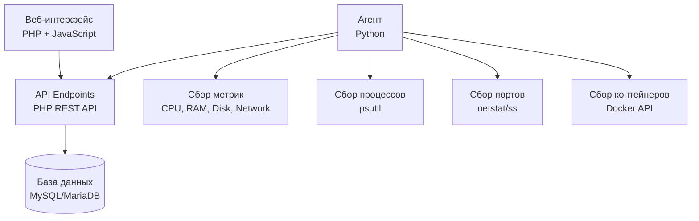

<div align="center">

# 🖥️ HostMonitor

### Современная система мониторинга серверов с веб-интерфейсом

[](LICENSE)
[](https://www.python.org/)
[](https://www.php.net/)
[](https://www.mysql.com/)

**Мониторинг серверов в реальном времени | Метрики | Процессы | Порты | Контейнеры**

[🚀 Быстрая установка](#-быстрая-установка) • [📖 Документация](#-документация) • [⚙️ Конфигурация](#️-конфигурация) • [🐛 Баги и исправления](#-последние-исправления)

</div>

---

## 📋 Содержание

- [Возможности](#-возможности)
- [Архитектура](#-архитектура)
- [Требования](#-требования)
- [Быстрая установка](#-быстрая-установка)
- [Конфигурация](#️-конфигурация)
- [Использование](#-использование)
- [Последние исправления](#-последние-исправления)
- [Поддержка](#-поддержка)

---

## ✨ Возможности

<table>
<tr>
<td width="50%">

### 📊 Мониторинг
-  **Метрики в реальном времени**: CPU, RAM, Disk, Network
-  **GPU мониторинг**: Загрузка, память, температура
-  **Процессы**: Список запущенных процессов с деталями
-  **Порты**: Мониторинг открытых портов и соединений
-  **Контейнеры**: Docker контейнеры и их статусы

</td>
<td width="50%">

### 🎨 Интерфейс
-  **Современный веб-интерфейс**: Адаптивный дизайн
-  **Дашборд**: Обзор всех нод на одной странице
-  **Графики**: Визуализация метрик и трендов
-  **Уведомления**: Система алертов и уведомлений
-  **Биллинг**: Учет расходов на провайдеров

</td>
</tr>
</table>

### 🔐 Безопасность
- ✅ Аутентификация пользователей
- ✅ Токены для агентов
- ✅ Защита API endpoints
- ✅ TLS/SSL поддержка

### 🚀 Производительность
- ⚡ Легковесный агент (Python)
- ⚡ Быстрый веб-интерфейс (PHP + JS)
- ⚡ Оптимизированные SQL запросы
- ⚡ Кэширование метрик

---

## 🏗️ Архитектура

<div align="center">



</div>

### Компоненты системы

|  Компонент | Технология | Описание |
|-----------|-----------|----------|
| ** Backend-агент** | Python 3.9+ | Собирает метрики, процессы, порты, контейнеры и отправляет на API |
| ** Веб-интерфейс** | PHP 8.0+ + JavaScript | Панель управления с дашбордом и настройками |
| ** API** | PHP REST API | Обработка запросов от агентов и веб-интерфейса |
| ** База данных** | MySQL/MariaDB | Хранение метрик, нод, пользователей, настроек |
| ** Веб-сервер** | Nginx / Python HTTP Server | Обслуживание веб-интерфейса |

---

## 📦 Требования

### Минимальные требования

<table>
<tr>
<th> Компонент</th>
<th>Версия</th>
<th>Примечание</th>
</tr>
<tr>
<td><strong> ОС</strong></td>
<td>Debian 11/12, Ubuntu 20.04+</td>
<td>Linux для production, Windows для dev</td>
</tr>
<tr>
<td><strong> Python</strong></td>
<td>3.9+</td>
<td>Для агента и веб-сервера</td>
</tr>
<tr>
<td><strong> PHP</strong></td>
<td>8.0+</td>
<td>С расширениями: <code>mysql</code>, <code>json</code></td>
</tr>
<tr>
<td><strong> База данных</strong></td>
<td>MySQL 8.0+ / MariaDB 10.5+</td>
<td>Для хранения данных</td>
</tr>
<tr>
<td><strong> Веб-сервер</strong></td>
<td>Nginx (production)</td>
<td>Опционально: Python HTTP Server для dev</td>
</tr>
</table>

### Дополнительные зависимости

- **Git** - для клонирования репозитория
- **Systemd** - для управления сервисами (Linux)
- **Docker** (опционально) - для контейнеризации

---

## 🚀 Быстрая установка

###  Установка панели управления (мастер-сервер)

<details>
<summary><b> Развернуть инструкцию</b></summary>

####  Вариант 1: Автоматическая установка (рекомендуется)

** Одна команда для установки:**

```bash
bash <(curl -sSL https://raw.githubusercontent.com/Differin3/HostMonitor/main/scripts/install_panel.sh)
```

Или с указанием репозитория:

```bash
bash <(curl -sSL https://raw.githubusercontent.com/Differin3/HostMonitor/main/scripts/install_panel.sh) https://github.com/Differin3/HostMonitor
```

** Что делает скрипт:**
-  Запрашивает выбор веб-сервера (nginx или Python)
-  Запрашивает порт для веб-интерфейса (по умолчанию: 80 для nginx, 8080 для Python)
-  Устанавливает все зависимости (Python, MariaDB, PHP)
-  Клонирует репозиторий в `/opt/monitoring`
-  Настраивает базу данных
-  Устанавливает и настраивает выбранный веб-сервер
-  Готово к использованию!

** После установки:**
1.  Откройте панель управления: `http://your-server-ip:PORT` или `http://your-domain:PORT`
2.  Порт будет указан в сообщении после установки
3.  Создайте ноду и экспортируйте конфиг для установки агента

#### Вариант 2: Ручная установка

```bash
# 1. Установка зависимостей и настройка БД
sudo ./install.sh

# 2. Установка веб-интерфейса
chmod +x scripts/install_web_debian.sh
sudo scripts/install_web_debian.sh
```

</details>

###  Установка агента на ноде

<details>
<summary><b> Развернуть инструкцию</b></summary>

####  Автоматическая установка

** Одна команда:**

```bash
bash <(curl -sSL https://raw.githubusercontent.com/Differin3/HostMonitor/main/scripts/install_agent.sh) https://github.com/Differin3/HostMonitor
```

** Что делает скрипт:**
-  Устанавливает зависимости (Python, git)
-  Клонирует репозиторий в `/opt/monitoring`
-  Создает виртуальное окружение
-  Устанавливает Python-зависимости
-  Готов к настройке конфига

####  Настройка после установки

1. ** Получите конфиг из панели управления:**
   -  Зайдите в панель управления
   -  Создайте ноду или откройте существующую
   -  Нажмите "Экспорт конфига" или скопируйте конфиг

2. ** Сохраните конфиг на сервере ноды:**
   ```bash
   sudo nano /opt/monitoring/agent/node.conf
   ```
   
   Вставьте конфиг (пример):
   ```ini
   MASTER_URL="https://your-master-server.com"
   NODE_NAME="node-1"
   NODE_TOKEN="your-node-token"
   COLLECT_INTERVAL=60
   TLS_VERIFY=false
   ```

3. ** Запустите агента:**
   ```bash
   # Как systemd сервис (рекомендуется)
   sudo cp /opt/monitoring/systemd/monitoring-agent.service /etc/systemd/system/
   sudo systemctl daemon-reload
   sudo systemctl enable --now monitoring-agent
   
   # Или вручную
   cd /opt/monitoring
   source .venv/bin/activate
   python agent/main.py
   ```

4. ** Проверьте статус:**
   ```bash
   sudo systemctl status monitoring-agent
   ```

</details>

---

## ⚙️ Конфигурация

###  Конфигурация агента

Агент настраивается через файл `agent/node.conf` или переменные окружения:

**Файл `agent/node.conf`:**
```ini
MASTER_URL="https://your-master-server.com"
NODE_NAME="node-1"
NODE_TOKEN="your-node-token"
COLLECT_INTERVAL=60
HEARTBEAT_INTERVAL=15
TLS_VERIFY=false
TLS_CERT_PATH=""
```

**Или переменные окружения:**
```bash
export MASTER_URL=https://your-master-server.com
export NODE_NAME=node-1
export NODE_TOKEN=your-node-token
export COLLECT_INTERVAL=60
```

###  Конфигурация базы данных

Настроить через переменные окружения:
```bash
export DB_HOST=localhost
export DB_PORT=3306
export DB_NAME=monitoring
export DB_USER=monitoring
export DB_PASSWORD=password
```

Или отредактировать `monitoring/includes/database.php`.

###  Конфигурация веб-сервера

**Python веб-сервер (dev/staging):**
```bash
export WEB_PORT=8080  # Порт по умолчанию: 8080
export WEB_HOST=0.0.0.0  # Адрес по умолчанию: 0.0.0.0
```

**Nginx (production):**
См. конфигурацию в `nginx/monitoring.conf`

###  Настройка домена и SSL

```bash
# Установить домен
scripts/set_domain.sh example.com www.example.com

# Настроить SSL (Let's Encrypt)
scripts/configure_ssl_letsencrypt.sh example.com admin@example.com www.example.com
```

---

## 📖 Использование

###  Пошаговая инструкция

<ol>
<li>
<strong> Установите панель управления:</strong>
<pre><code>bash &lt;(curl -sSL https://raw.githubusercontent.com/Differin3/HostMonitor/main/scripts/install_panel.sh)</code></pre>
</li>

<li>
<strong> Создайте ноду в панели управления:</strong>
<ul>
<li> Зайдите в панель управления</li>
<li> Создайте новую ноду</li>
<li> Нажмите "Экспорт конфига" или скопируйте конфиг</li>
</ul>
</li>

<li>
<strong> Установите агент на ноде:</strong>
<pre><code>bash &lt;(curl -sSL https://raw.githubusercontent.com/Differin3/HostMonitor/main/scripts/install_agent.sh) https://github.com/Differin3/HostMonitor</code></pre>
</li>

<li>
<strong> Настройте конфиг агента:</strong>
<ul>
<li> Сохраните конфиг из панели в <code>/opt/monitoring/agent/node.conf</code></li>
<li> Или скопируйте конфиг через веб-интерфейс</li>
</ul>
</li>

<li>
<strong> Запустите агента:</strong>
<pre><code>sudo cp /opt/monitoring/systemd/monitoring-agent.service /etc/systemd/system/
sudo systemctl daemon-reload
sudo systemctl enable --now monitoring-agent</code></pre>
</li>

<li>
<strong> Проверьте статус:</strong>
<ul>
<li> В панели управления нода должна появиться как "online"</li>
<li> Метрики начнут собираться автоматически</li>
<li> Проверка: <code>sudo systemctl status monitoring-agent</code></li>
</ul>
</li>
</ol>

###  Docker

Запуск через Docker Compose:

```bash
cd docker
docker-compose up -d
```

** Примечание:** В Docker Compose веб-интерфейс доступен на порту **8080** (маппинг `8080:80`).

---

## 🐛 Последние исправления

###  Исправление бага с отображением нод (2024)

** Проблема:**
-  Ноды со статусом `offline` пропадали из списка
-  При статусе `online` появлялись дубликаты нод
-  Нестабильное отображение при перезагрузке страницы

** Причина:**
1.  Сложная логика ручного удаления дубликатов по ID
2.  Автоматическое обновление статуса в БД при каждом GET-запросе
3.  Отсутствие JOIN с таблицей providers

** Решение:**
1.  Возврат к простому LEFT JOIN запросу (как в старой версии)
2.  Убрано автоматическое обновление статуса в БД - статус обновляется только через heartbeat/refresh
3.  Упрощена логика удаления дубликатов

** Результат:**
-  Все ноды отображаются корректно (online/offline)
-  Нет дубликатов
-  Стабильное отображение
-  Меньше нагрузка на БД

** Файлы:**
-  `monitoring/api/nodes.php` - основной файл с исправлениями

---

## 🆘 Поддержка

###  Документация

-  **API документация**: См. файлы в `frontend/docs/api-contracts.md`
-  **UI/UX документация**: См. файлы в `frontend/docs/uiux.md`
-  **База данных**: Схемы в `database/schema_mysql.sql`

###  Отладка

**Проверка логов агента:**
```bash
sudo journalctl -u monitoring-agent -f
```

**Проверка логов веб-сервера:**
```bash
# Nginx
sudo tail -f /var/log/nginx/error.log

# Python веб-сервер
sudo journalctl -u monitoring-web -f
```

**Проверка подключения к БД:**
```bash
mysql -u monitoring -p monitoring
```

### 🐛 Сообщить о проблеме

Если вы нашли баг или у вас есть предложение:
1. Проверьте существующие [Issues](https://github.com/Differin3/HostMonitor/issues)
2. Создайте новый Issue с подробным описанием проблемы
3. Приложите логи и скриншоты (если применимо)

---

## 📄 Лицензия

Этот проект распространяется под лицензией MIT. См. файл [LICENSE](LICENSE) для подробностей.

---

<div align="center">

**Сделано с ❤️ для мониторинга серверов**

[⬆ Наверх](#-hostmonitor)

</div>
