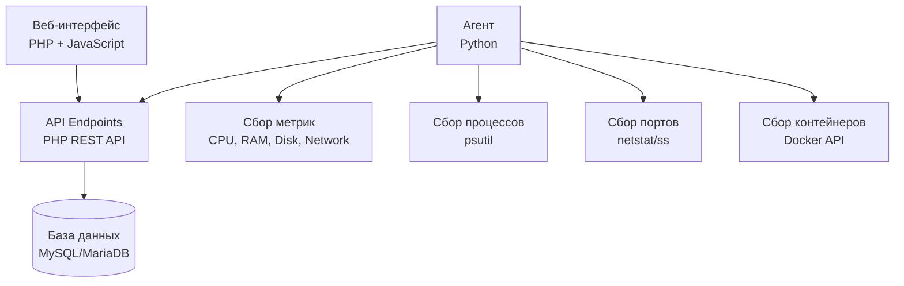

<div align="center">

#  HostMonitor

### Современная система мониторинга серверов с веб-интерфейсом

[](LICENSE)
[](https://www.python.org/)
[](https://www.php.net/)
[](https://www.mysql.com/)

**Мониторинг серверов в реальном времени | Метрики | Процессы | Порты | Контейнеры**

[ Быстрая установка](#-быстрая-установка) • [ Документация](#-документация) • [ Конфигурация](#️-конфигурация) • [ Исправления](#-последние-исправления)

</div>

---

## 📋 Содержание

- [Возможности](#-возможности)
- [Архитектура](#-архитектура)
- [Требования](#-требования)
- [Быстрая установка](#-быстрая-установка)
- [Конфигурация](#️-конфигурация)
- [Использование](#-использование)
- [Последние исправления](#-последние-исправления)
- [Поддержка](#-поддержка)

---

##  Возможности

<table>
<tr>
<td width="50%">

###  Мониторинг
-  **Метрики в реальном времени**: CPU, RAM, Disk, Network
-  **GPU мониторинг**: Загрузка, память, температура
-  **Процессы**: Список запущенных процессов с деталями
-  **Порты**: Мониторинг открытых портов и соединений
-  **Контейнеры**: Docker контейнеры и их статусы

</td>
<td width="50%">

###  Интерфейс
-  **Современный веб-интерфейс**: Адаптивный дизайн
-  **Дашборд**: Обзор всех нод на одной странице
-  **Графики**: Визуализация метрик и трендов
-  **Уведомления**: Система алертов и уведомлений
-  **Биллинг**: Учет расходов на провайдеров

</td>
</tr>
</table>

###  Безопасность
-  Аутентификация пользователей
-  Токены для агентов
-  Защита API endpoints
-  TLS/SSL поддержка

###  Производительность
-  Легковесный агент (Python)
-  Быстрый веб-интерфейс (PHP + JS)
-  Оптимизированные SQL запросы
-  Кэширование метрик

---

## 🏗️ Архитектура

<div align="center">



</div>

### Компоненты системы

| 🖥️ Компонент | Технология | Описание |
|-----------|-----------|----------|
| **⚙️ Backend-агент** | Python 3.9+ | Собирает метрики, процессы, порты, контейнеры и отправляет на API |
| **🏠 Веб-интерфейс** | PHP 8.0+ + JavaScript | Панель управления с дашбордом и настройками |
| **📡 API** | PHP REST API | Обработка запросов от агентов и веб-интерфейса |
| **💾 База данных** | MySQL/MariaDB | Хранение метрик, нод, пользователей, настроек |
| **🌐 Веб-сервер** | Nginx / Python HTTP Server | Обслуживание веб-интерфейса |

---

## 📦 Требования

### Минимальные требования

<table>
<tr>
<th>⚙️ Компонент</th>
<th>Версия</th>
<th>Примечание</th>
</tr>
<tr>
<td><strong>🖥️ ОС</strong></td>
<td>Debian 11/12, Ubuntu 20.04+</td>
<td>Linux для production, Windows для dev</td>
</tr>
<tr>
<td><strong>🐍 Python</strong></td>
<td>3.9+</td>
<td>Для агента и веб-сервера</td>
</tr>
<tr>
<td><strong>🐘 PHP</strong></td>
<td>8.0+</td>
<td>С расширениями: <code>mysql</code>, <code>json</code></td>
</tr>
<tr>
<td><strong>💾 База данных</strong></td>
<td>MySQL 8.0+ / MariaDB 10.5+</td>
<td>Для хранения данных</td>
</tr>
<tr>
<td><strong>🌐 Веб-сервер</strong></td>
<td>Nginx (production)</td>
<td>Опционально: Python HTTP Server для dev</td>
</tr>
</table>

### Дополнительные зависимости

- **Git** - для клонирования репозитория
- **Systemd** - для управления сервисами (Linux)
- **Docker** (опционально) - для контейнеризации

---

## 🚀 Быстрая установка

### 🖥️ Установка панели управления (мастер-сервер)

<details>
<summary><b>🔽 Развернуть инструкцию</b></summary>

#### 🚀 Вариант 1: Автоматическая установка (рекомендуется)

**▶️ Одна команда для установки:**

```bash
bash <(curl -sSL https://raw.githubusercontent.com/Differin3/HostMonitor/main/scripts/install_panel.sh)
```

Или с указанием репозитория:

```bash
bash <(curl -sSL https://raw.githubusercontent.com/Differin3/HostMonitor/main/scripts/install_panel.sh) https://github.com/Differin3/HostMonitor
```

**✅ Что делает скрипт:**
- ⚙️ Запрашивает выбор веб-сервера (nginx или Python)
- 🌐 Запрашивает порт для веб-интерфейса (по умолчанию: 80 для nginx, 8080 для Python)
- 📥 Устанавливает все зависимости (Python, MariaDB, PHP)
- 🌿 Клонирует репозиторий в `/opt/monitoring`
- 💾 Настраивает базу данных
- 🖥️ Устанавливает и настраивает выбранный веб-сервер
- ✅ Готово к использованию!

**➡️ После установки:**
1. 🌐 Откройте панель управления: `http://your-server-ip:PORT` или `http://your-domain:PORT`
2. ℹ️ Порт будет указан в сообщении после установки
3. ➕ Создайте ноду и экспортируйте конфиг для установки агента

#### Вариант 2: Ручная установка

```bash
# 1. Установка зависимостей и настройка БД
sudo ./install.sh

# 2. Установка веб-интерфейса
chmod +x scripts/install_web_debian.sh
sudo scripts/install_web_debian.sh
```

</details>

### ⚙️ Установка агента на ноде

<details>
<summary><b>🔽 Развернуть инструкцию</b></summary>

#### 🚀 Автоматическая установка

**▶️ Одна команда:**

```bash
bash <(curl -sSL https://raw.githubusercontent.com/Differin3/HostMonitor/main/scripts/install_agent.sh) https://github.com/Differin3/HostMonitor
```

**✅ Что делает скрипт:**
- 📥 Устанавливает зависимости (Python, git)
- 🌿 Клонирует репозиторий в `/opt/monitoring`
- 📁 Создает виртуальное окружение
- 📦 Устанавливает Python-зависимости
- ✅ Готов к настройке конфига

#### ⚙️ Настройка после установки

1. **📥 Получите конфиг из панели управления:**
   - 🏠 Зайдите в панель управления
   - ➕ Создайте ноду или откройте существующую
   - 📥 Нажмите "Экспорт конфига" или скопируйте конфиг

2. **📄 Сохраните конфиг на сервере ноды:**
   ```bash
   sudo nano /opt/monitoring/agent/node.conf
   ```
   
   Вставьте конфиг (пример):
   ```ini
   MASTER_URL="https://your-master-server.com"
   NODE_NAME="node-1"
   NODE_TOKEN="your-node-token"
   COLLECT_INTERVAL=60
   TLS_VERIFY=false
   ```

3. **▶️ Запустите агента:**
   ```bash
   # Как systemd сервис (рекомендуется)
   sudo cp /opt/monitoring/systemd/monitoring-agent.service /etc/systemd/system/
   sudo systemctl daemon-reload
   sudo systemctl enable --now monitoring-agent
   
   # Или вручную
   cd /opt/monitoring
   source .venv/bin/activate
   python agent/main.py
   ```

4. **✅ Проверьте статус:**
   ```bash
   sudo systemctl status monitoring-agent
   ```

</details>

---

## ⚙️ Конфигурация

### ⚙️ Конфигурация агента

Агент настраивается через файл `agent/node.conf` или переменные окружения:

**Файл `agent/node.conf`:**
```ini
MASTER_URL="https://your-master-server.com"
NODE_NAME="node-1"
NODE_TOKEN="your-node-token"
COLLECT_INTERVAL=60
HEARTBEAT_INTERVAL=15
TLS_VERIFY=false
TLS_CERT_PATH=""
```

**Или переменные окружения:**
```bash
export MASTER_URL=https://your-master-server.com
export NODE_NAME=node-1
export NODE_TOKEN=your-node-token
export COLLECT_INTERVAL=60
```

### 💾 Конфигурация базы данных

Настроить через переменные окружения:
```bash
export DB_HOST=localhost
export DB_PORT=3306
export DB_NAME=monitoring
export DB_USER=monitoring
export DB_PASSWORD=password
```

Или отредактировать `monitoring/includes/database.php`.

### 🌐 Конфигурация веб-сервера

**Python веб-сервер (dev/staging):**
```bash
export WEB_PORT=8080  # Порт по умолчанию: 8080
export WEB_HOST=0.0.0.0  # Адрес по умолчанию: 0.0.0.0
```

**Nginx (production):**
См. конфигурацию в `nginx/monitoring.conf`

### 🔒 Настройка домена и SSL

```bash
# Установить домен
scripts/set_domain.sh example.com www.example.com

# Настроить SSL (Let's Encrypt)
scripts/configure_ssl_letsencrypt.sh example.com admin@example.com www.example.com
```

---

## 📖 Использование

### 📋 Пошаговая инструкция

<ol>
<li>
<strong>🖥️ Установите панель управления:</strong>
<pre><code>bash &lt;(curl -sSL https://raw.githubusercontent.com/Differin3/HostMonitor/main/scripts/install_panel.sh)</code></pre>
</li>

<li>
<strong>➕ Создайте ноду в панели управления:</strong>
<ul>
<li>🏠 Зайдите в панель управления</li>
<li>➕ Создайте новую ноду</li>
<li>📥 Нажмите "Экспорт конфига" или скопируйте конфиг</li>
</ul>
</li>

<li>
<strong>⚙️ Установите агент на ноде:</strong>
<pre><code>bash &lt;(curl -sSL https://raw.githubusercontent.com/Differin3/HostMonitor/main/scripts/install_agent.sh) https://github.com/Differin3/HostMonitor</code></pre>
</li>

<li>
<strong>⚙️ Настройте конфиг агента:</strong>
<ul>
<li>📄 Сохраните конфиг из панели в <code>/opt/monitoring/agent/node.conf</code></li>
<li>📋 Или скопируйте конфиг через веб-интерфейс</li>
</ul>
</li>

<li>
<strong>▶️ Запустите агента:</strong>
<pre><code>sudo cp /opt/monitoring/systemd/monitoring-agent.service /etc/systemd/system/
sudo systemctl daemon-reload
sudo systemctl enable --now monitoring-agent</code></pre>
</li>

<li>
<strong>✅ Проверьте статус:</strong>
<ul>
<li>📊 В панели управления нода должна появиться как "online"</li>
<li>📈 Метрики начнут собираться автоматически</li>
<li>ℹ️ Проверка: <code>sudo systemctl status monitoring-agent</code></li>
</ul>
</li>
</ol>

### 🐳 Docker

Запуск через Docker Compose:

```bash
cd docker
docker-compose up -d
```

**ℹ️ Примечание:** В Docker Compose веб-интерфейс доступен на порту **8080** (маппинг `8080:80`).

---

## 🐛 Последние исправления

### ✅ Исправление бага с отображением нод (2024)

**⚠️ Проблема:**
- 🖥️ Ноды со статусом `offline` пропадали из списка
- 📋 При статусе `online` появлялись дубликаты нод
- 🔄 Нестабильное отображение при перезагрузке страницы

**🔍 Причина:**
1. 💻 Сложная логика ручного удаления дубликатов по ID
2. 💾 Автоматическое обновление статуса в БД при каждом GET-запросе
3. 🔗 Отсутствие JOIN с таблицей providers

**🔧 Решение:**
1. ✅ Возврат к простому LEFT JOIN запросу (как в старой версии)
2. ✅ Убрано автоматическое обновление статуса в БД - статус обновляется только через heartbeat/refresh
3. ✅ Упрощена логика удаления дубликатов

**✅ Результат:**
- ✅ Все ноды отображаются корректно (online/offline)
- ✅ Нет дубликатов
- ✅ Стабильное отображение
- ✅ Меньше нагрузка на БД

**📄 Файлы:**
- 💻 `monitoring/api/nodes.php` - основной файл с исправлениями

---

## 🆘 Поддержка

### 📚 Документация

- 📄 **API документация**: См. файлы в `frontend/docs/api-contracts.md`
- 🎨 **UI/UX документация**: См. файлы в `frontend/docs/uiux.md`
- 💾 **База данных**: Схемы в `database/schema_mysql.sql`

### 🔍 Отладка

**Проверка логов агента:**
```bash
sudo journalctl -u monitoring-agent -f
```

**Проверка логов веб-сервера:**
```bash
# Nginx
sudo tail -f /var/log/nginx/error.log

# Python веб-сервер
sudo journalctl -u monitoring-web -f
```

**Проверка подключения к БД:**
```bash
mysql -u monitoring -p monitoring
```

### 🐛 Сообщить о проблеме

Если вы нашли баг или у вас есть предложение:
1. Проверьте существующие [Issues](https://github.com/Differin3/HostMonitor/issues)
2. Создайте новый Issue с подробным описанием проблемы
3. Приложите логи и скриншоты (если применимо)

---

## 📄 Лицензия

Этот проект распространяется под лицензией MIT. См. файл [LICENSE](LICENSE) для подробностей.

---

<div align="center">

**Сделано с ❤️ для мониторинга серверов**

[⬆ Наверх](#-hostmonitor)

</div>
